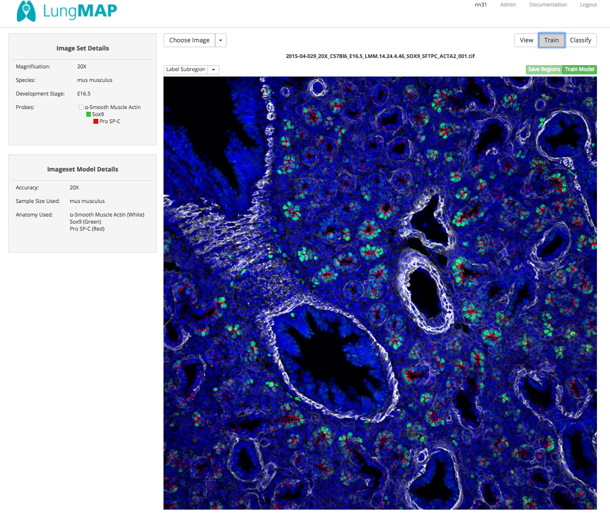

# User Interface Instructions

Welcome to `ihc-image-analysis`, an application that exposes, curates, and brings computer vision to Lungmap data. 
The following instructions provide additional details to the use of our applicatoin. Specifically,

1.  [Choosing an Image Set](#choosing-an-imageset)
- [Side Panel](#side-panel)
- [Image Set Selection](#image-set-selection)
2.  [Navigating within an Image Set](#navigating-an-imageset)
- [Generating Training Data](#generating-training-data)
- [Classifying Anatomy](#classifying-anatomy)
- [RESTful Application Programming Interface](#restful)

## Choosing an Image Set 
`ImageSets` are a collection of LungMap images grouped together according to the following four variables:  
- Species
- Magnification
- Development Stage
- Probe

These groups of images make up a critical component of the `ihc-image-analysis` application because our solution to 
automatically annotate a given image segmentation relies on strata defined models made up of these four variables.
Our first page provides functionality to narrow focus to imagesets by allowing users to subset based on these four 
variables.

### Side Panel 
The `side panel` allows users to subset `ImageSets`. Here is a quick overview of the side panel:  

To utilize the side panel to narrow the scope of available `ImageSets`, it is important to remeber that all chosen 
options are chained together with an `OR` statement within a given variable and `AND` between different variables. So for example, if I were to click `Apply` with the boxes checked 
above, the system would interpret this request as:
> Give me all imagesets with (species='mus musculus`) **AND** (sidepanel='100X' *OR* sidepanel='40X') **AND** (probe='Acetylated Tubulin' *OR* probe='Muc5AC' *OR* probe='Lyve-1')
 
### Image Set Selection 
Once the results have been narrowed sufficiently, a user will want to choose a given image set. Use the `Apply` button to filter
the results. Once filtered, results are displayed to the right of the side panel:

To actually filter the results, click the `View` button and a new user interface will be given.

## Navigating within an Image Set 
After selecting an imageset, you'll be presented with this screen:

Keep in mind an `ImageSet` is just a collection of images with similar attributes. The left-hand side panel, is a view
into descriptions about imageset specific criteria and summaries. To drill down into images, select the drop down menu
titled `Choose Images`. This will automatically populated a list of all available images in the imageset. You can choose 
to load one into the work panel below by clicking on the desired image name. Once chosen, your screen should look like 
this:

**Notice** the three new buttons that appear above the image (i.e. View, Train, Classify). These buttons change the view 
of the work panel. *View* simply allows users to look at the image. The other two buttons, have significantly more 
capabilities and we'll walk though that in the next two sections. 

### Generating Training Data 
After selecting the train button, your screen should look similar to this:

**Notice** additional buttons are now available in the work panel. Specifically, these are a drop down menu `Label 
Subregion`, and a button that is inactive named Save Subregions. `Save Subregions` will remain inactive until the user
chooses a subregion to select. So here is the sequence to generate training data:

(1) Choose the anatomy that you want to begin to segment from the drop down list `Label Subregions`.
(2) Once chosen, the name of the subregion should appear in the center above the image.
(3) If other users have generated training data for that image. The segments will automatically appear.
(4) To begin capturing new segments, left-click anywhere around the segment of interest.
(5) Continue to left-click around the segment until it is completly encapsulated.

Training data can be defined as the segmentation of anatomy within a given Imageset/Image. An example of this can be
see here:

### Classifying Anatomy 

### RESTful Application Programming Interface 